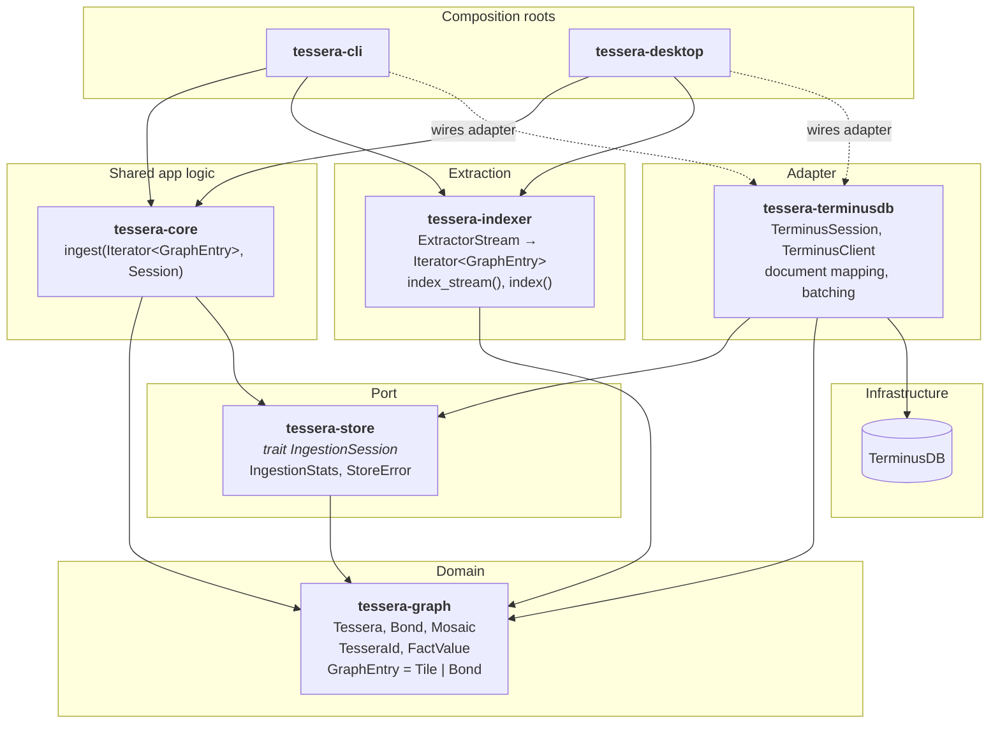
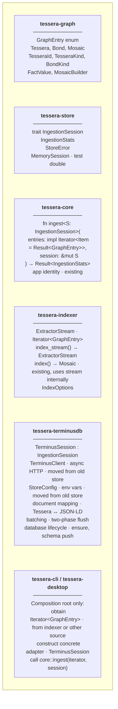
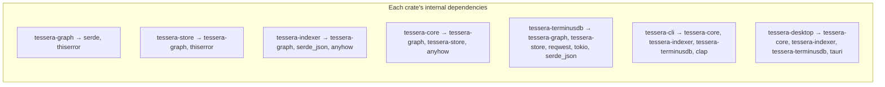
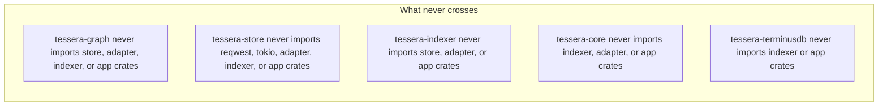

# Architecture

## Crate dependency graph

```mermaid
graph TB
    subgraph "Domain"
        GRAPH["<b>tessera-graph</b><br/>Tessera, Bond, Mosaic<br/>TesseraId, FactValue<br/>GraphEntry = Tile | Bond"]
    end

    subgraph "Port"
        STORE["<b>tessera-store</b><br/><i>trait IngestionSession</i><br/>IngestionStats, StoreError"]
    end

    subgraph "Shared app logic"
        CORE["<b>tessera-core</b><br/>ingest(Iterator&lt;GraphEntry&gt;, Session)"]
    end

    subgraph "Extraction"
        IDX["<b>tessera-indexer</b><br/>ExtractorStream → Iterator&lt;GraphEntry&gt;<br/>index_stream(), index()"]
    end

    subgraph "Adapter"
        TDB["<b>tessera-terminusdb</b><br/>TerminusSession, TerminusClient<br/>document mapping, batching"]
    end

    subgraph "Composition roots"
        CLI["<b>tessera-cli</b>"]
        DESK["<b>tessera-desktop</b>"]
    end

    subgraph "Infrastructure"
        DB[(TerminusDB)]
    end

    STORE --> GRAPH
    IDX --> GRAPH
    CORE --> GRAPH
    CORE --> STORE
    TDB --> STORE
    TDB --> GRAPH
    TDB --> DB

    CLI --> CORE
    CLI --> IDX
    CLI -.->|"wires adapter"| TDB

    DESK --> CORE
    DESK --> IDX
    DESK -.->|"wires adapter"| TDB
```

## What lives where

```mermaid
graph TB
    subgraph " "
        direction TB
        G["<b>tessera-graph</b><br/>─────────────<br/>GraphEntry enum<br/>Tessera, Bond, Mosaic<br/>TesseraId, TesseraKind, BondKind<br/>FactValue, MosaicBuilder"]
        S["<b>tessera-store</b><br/>─────────────<br/>trait IngestionSession<br/>IngestionStats<br/>StoreError<br/>MemorySession · test double"]
        C["<b>tessera-core</b><br/>─────────────<br/>fn ingest&lt;S: IngestionSession&gt;(<br/>  entries: impl Iterator&lt;Item = Result&lt;GraphEntry&gt;&gt;,<br/>  session: &amp;mut S<br/>) → Result&lt;IngestionStats&gt;<br/>app identity · existing"]
        I["<b>tessera-indexer</b><br/>─────────────<br/>ExtractorStream · Iterator&lt;GraphEntry&gt;<br/>index_stream() → ExtractorStream<br/>index() → Mosaic · existing, uses stream internally<br/>IndexOptions"]
        T["<b>tessera-terminusdb</b><br/>─────────────<br/>TerminusSession : IngestionSession<br/>TerminusClient · async HTTP · moved from old store<br/>StoreConfig · env vars · moved from old store<br/>document mapping · Tessera ↔ JSON-LD<br/>batching · two-phase flush<br/>database lifecycle · ensure, schema push"]
        B["<b>tessera-cli / tessera-desktop</b><br/>─────────────<br/>Composition root only:<br/>  obtain Iterator&lt;GraphEntry&gt; · from indexer or other source<br/>  construct concrete adapter · TerminusSession<br/>  call core::ingest(iterator, session)"]
    end

    G ~~~ S
    S ~~~ C
    C ~~~ I
    I ~~~ T
    T ~~~ B
```

## Dependency boundaries

```mermaid
graph TB
    subgraph "Each crate's internal dependencies"
        direction TB
        G["tessera-graph → serde, thiserror"]
        S["tessera-store → tessera-graph, thiserror"]
        I["tessera-indexer → tessera-graph, serde_json, anyhow"]
        C["tessera-core → tessera-graph, tessera-store, anyhow"]
        T["tessera-terminusdb → tessera-graph, tessera-store, reqwest, tokio, serde_json"]
        CLI["tessera-cli → tessera-core, tessera-indexer, tessera-terminusdb, clap"]
        D["tessera-desktop → tessera-core, tessera-indexer, tessera-terminusdb, tauri"]
    end
```

```mermaid
graph TB
    subgraph "What never crosses"
        direction TB
        N1["tessera-graph never imports store, adapter, indexer, or app crates"]
        N2["tessera-store never imports reqwest, tokio, adapter, indexer, or app crates"]
        N3["tessera-indexer never imports store, adapter, or app crates"]
        N4["tessera-core never imports indexer, adapter, or app crates"]
        N5["tessera-terminusdb never imports indexer or app crates"]
    end
```